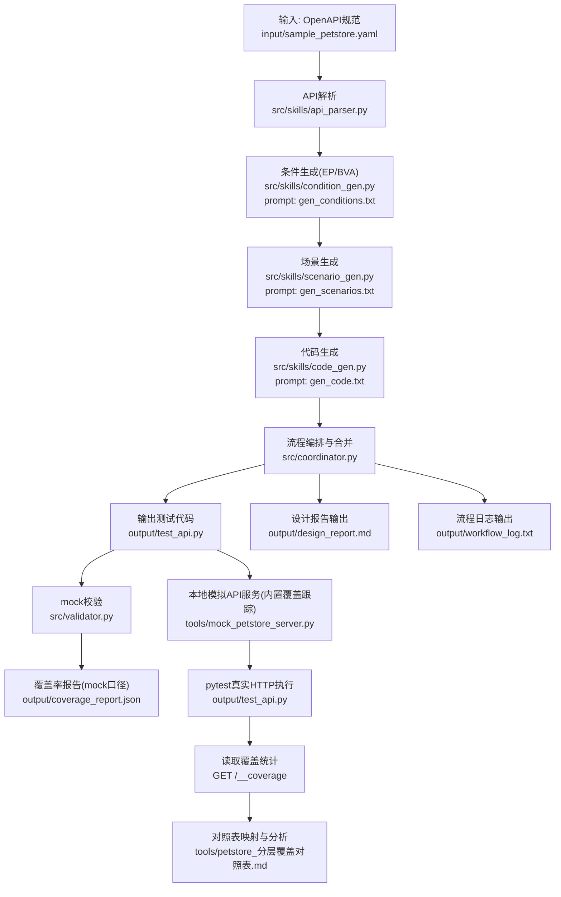

# 示例提交文档：AITestFlow（中文版）

**题目：** 基于 OpenAPI、等价类划分（EP）与边界值分析（BVA）的 LLM 驱动 REST API 黑盒测试生成

---

## 1. 输入说明

### 1.1 被测对象

被测系统为 HTTP REST API，测试方式为黑盒测试，仅依据接口契约（OpenAPI 3.x）进行测试设计与验证。

### 1.2 实验输入

输入规范文件：`input/sample_petstore.yaml`

覆盖的操作如下：

- `GET /pets`
- `POST /pets`
- `GET /pets/{petId}`
- `DELETE /pets/{petId}`
- `POST /pets/{petId}/vaccinations`

---

## 2. 工具产物与流程说明



### 2.1 生成流程

本仓库在“生成测试代码”阶段不是一次性生成，而是按如下链路逐步产出：

1. **OpenAPI 解析阶段**：读取 `input/sample_petstore.yaml`，抽取每个端点的方法、路径参数、query 参数、请求体字段、约束与响应码。
2. **条件生成阶段（EP/BVA）**：针对“单个端点”生成有效类、无效类、边界类条件，形成结构化 `conditions` 列表。
3. **场景合成阶段**：把 `conditions` 组合为可执行 `test_cases`，每条用例都带 `covered_condition_ids`，用于后续覆盖率追踪。
4. **代码生成阶段**：基于场景生成 pytest 模块代码；多端点结果由 `coordinator` 合并输出为一个 `output/test_api.py`。
5. **mock 校验阶段**：执行内部 mock 校验并写入 `output/coverage_report.json`，用于设计侧覆盖率统计。
6. **真实执行评估阶段（mock 内置覆盖统计）**：启动 `tools/mock_petstore_server.py`，执行 `python -m pytest output/test_api.py -v` 后，通过 `GET /__coverage` 读取覆盖结果；再映射到 `tools/petstore_分层覆盖对照表.md` 做人工复核。

当前评估划分逻辑如下：

- **接口划分（操作单元）**：按 `method + path` 划分 5 个操作（`GET/POST /pets`、`GET/DELETE /pets/{petId}`、`POST /pets/{petId}/vaccinations`）。
- **输入分层（EP + BVA）**：类型有效/无效、取值范围内/范围外、边界值、必填缺失、日期格式有效/无效等。
- **输出分层（状态码）**：按接口目标状态码分区（成功类、参数非法类、资源不存在类、服务端异常类）。
- **自动统计输出**：按 C 表条件 ID（`C01..C47`）统计覆盖，默认剔除 `500` 条件（`C04/C08/C14/C18/C21/C25/C30/C35`）。
- **人工复核输出**：根据自动统计结果与用例语义，复核对照表覆盖情况与未覆盖项。

### 2.2 核心组件

本项目“工具产物”按输入、过程、输出三类组织。下面给出每类产物的用途与最小使用示例。

**输入工具产物**

- `input/sample_petstore.yaml`：被测 API 契约来源。  
  示例：`GET /pets` 中提取出 `limit`（1~100）与 `status`（枚举）约束，供后续生成 EP/BVA 条件。
- `src/prompts/gen_conditions.txt`、`src/prompts/gen_scenarios.txt`、`src/prompts/gen_code.txt`：三阶段提示词模板。  
  示例：`gen_scenarios.txt` 强制每条用例必须包含 `covered_condition_ids`，用于覆盖率回溯。

**过程工具产物**

- `src/skills/api_parser.py`：将 OpenAPI 转成统一端点元数据结构。  
  示例：把 `POST /pets` 解析为「method/path/parameters/requestBody/responses/constraints」对象。
- `src/skills/condition_gen.py`：调用 LLM 生成条件列表。  
  示例：对 `limit` 生成 `valid`、`invalid`、`boundary` 条件，如 1、100、0、101。
- `src/skills/scenario_gen.py`：把条件组合为可执行测试场景。  
  示例：把 `status_invalid_1` 映射到一个 `expected_status=400` 的测试用例，并写入 `covered_condition_ids`。
- `src/skills/code_gen.py`：把场景数组转为 pytest 代码。  
  示例：将 `test_cases` 转成 `@pytest.mark.parametrize` 结构和统一的 `make_request` 调用。
- `src/coordinator.py`：编排端点循环、代码合并与报告输出。  
  示例：对 5 个端点重复“条件 -> 场景 -> 代码”流程，并合并为一个 `output/test_api.py`。
- `src/validator.py`：mock 校验与覆盖状态更新。  
  若某测试失败，则将其关联的条件 ID 从“已覆盖集合”中移除。

**输出工具产物**

- `output/test_api.py`：最终可执行测试文件。  
  直接执行 `python -m pytest output/test_api.py -v`对黑箱内容进行测试。
- `output/design_report.md`：EP/BVA 条件与样例用例表。  
  方便按端点查看条件 ID、分区类型、样例请求和期望状态。
- `output/coverage_report.json`：mock 校验口径覆盖率。  
  计算方式：`coverage_rate = validated_covered_count / total_conditions`。  
  其中 `total_conditions` 是所有端点生成的条件总数；`validated_covered_count` 是在 mock 校验后仍被判定为覆盖的条件数。  
  mock 校验过程为：先把生成代码写入临时 pytest 文件，并注入 `make_request` mock（直接返回 `expected_status`，不访问真实服务）；再执行 pytest，收集失败测试；随后根据参数化测试的 `test_id` 把失败测试映射回对应的 `covered_condition_ids`。凡是映射到失败测试的条件 ID，都会从已覆盖集合中移除，因此被判定为“未覆盖/覆盖无效”。  
  该指标表示“测试设计与生成逻辑是否自洽并覆盖条件”，不等价于真实 API 的通过率。
- `tools/petstore_分层覆盖对照表.md`：真实执行口径的输入/输出组合条件基准表（含 C 表 `C01..C47`）。  
  执行方式：启动 `tools/mock_petstore_server.py` 并运行 `python -m pytest output/test_api.py -v`，再访问 `GET /__coverage` 获取覆盖统计。  
  划分与计算方式：服务器按 C 表条件自动记录覆盖；计算覆盖率时剔除 `500` 条件后统计。  
  指标含义：表示“真实 HTTP 往返执行下，可测条件（不含 500）被命中的比例”。
- `output/workflow_log.txt`：流水线日志。  
  负责定位某端点第几轮迭代出现覆盖率下降或校验异常。

### 2.3 模型与提示词逻辑

- **运行模型配置（来自 `.env`）**
  - `LLM_BASE_URL=https://api.deepseek.com`
  - `LLM_MODEL=deepseek-chat`
  - 即本项目通过 OpenAI 兼容接口调用 DeepSeek 的 `DeepSeek-V3.2` 模型。

- **提示词内容与逻辑（节选）**
  1. `gen_conditions.txt`（条件生成）
     - 关键约束：`Use ONLY parameters that appear in the specification`、`partition_type: valid|invalid|boundary`。
     - 输出格式：`{"conditions": [{"id","parameter","partition_type","description","values"}]}`
     - 逻辑作用：保证条件来自契约字段，不引入“规范外参数”。
  2. `gen_scenarios.txt`（场景生成）
     - 关键约束：每条 `test_case` 必须包含 `test_id/endpoint/method/query/payload/expected_status/covered_condition_ids`。
     - 关键规则：`Every condition id ... MUST appear in at least one test case`。
     - 逻辑作用：建立“条件 -> 测试用例”映射，支持覆盖率追踪与失败归因。
  3. `gen_code.txt`（代码生成）
     - 关键约束：输出一个 pytest 模块；必须有统一 `make_request`；必须用 `@pytest.mark.parametrize`，并以 `test_id` 作为节点 ID。
     - 输出包装：返回 `{"python_code": "..."}`。
     - 逻辑作用：把结构化场景稳定落地成可执行测试脚本。
  4. 端到端编排
     - `coordinator` 以“每端点一轮三阶段”的方式执行上述提示词链路，再统一合并、校验并生成报告。

### 2.4 工具产物快照：`output/coverage_report.json`（迭代指标）

该文件属于流程内工具产物，不作为最终业务效果结论，而是用于驱动“生成-校验-修正”的迭代反馈。

| 指标 | 数值 |
|------|------|
| `total_conditions` | 57 |
| `validated_covered_count` | 57 |
| `coverage_rate` | 1.0（100%） |
| `endpoints_processed` | 5 |
| `failed_test_cases` | [] |

端点级快照：

| 方法 | 路径 | 条件总数 | 已覆盖 | 覆盖率 |
|------|------|----------|--------|--------|
| GET | `/pets` | 13 | 13 | 100% |
| POST | `/pets` | 18 | 18 | 100% |
| GET | `/pets/{petId}` | 7 | 7 | 100% |
| DELETE | `/pets/{petId}` | 8 | 8 | 100% |
| POST | `/pets/{petId}/vaccinations` | 11 | 11 | 100% |

说明：这里的“内部校验口径”是指 `src/validator.py` 的 mock 校验流程。所谓“场景校验”，就是把生成的每条测试场景（包含 `endpoint/method/query/payload/expected_status`）作为可执行用例运行一次，并校验其断言是否成立（核心是状态码是否符合预期，必要时检查响应结构）；校验不依赖真实服务。该口径下，只要某条件至少被一条“校验通过”的场景命中，就记为已覆盖；若场景失败，其关联的 `covered_condition_ids` 会被剔除，不计入已覆盖。因此该指标反映的是“条件设计与场景映射的一致性”，不直接代表真实 HTTP 执行效果。

该指标同时作为流水线迭代优化的反馈信号：每轮都会根据 `failed_test_cases` 与未被验证覆盖的条件，回溯到对应端点与条件分区（valid/invalid/boundary），再补充或修正场景并重新生成代码。由于每轮都在“补齐未覆盖条件 + 修复失败场景映射”，所以设计侧覆盖率通常会随迭代上升，直到达到阈值或迭代上限。

---

## 3. 生成结果

### 3.1 设计报告（提示词驱动的 EP/BVA 划分结果）

数据来源：`output/design_report.md`

该报告用于展示“提示词喂给 AI 后，如何把 OpenAPI 约束落地为等价类与边界值”。下面用三个表说明关键链路：

| 阶段 | 关键提示词约束 | AI 产出内容 | 报告体现位置 |
|---|---|---|---|
| 条件生成 | `partition_type: valid|invalid|boundary` | 参数级条件列表（含条件 ID） | Equivalence partitioning / Boundary value analysis |
| 场景生成 | 每条场景必须含 `covered_condition_ids` | 条件到测试场景的映射 | Sample test cases |
| 代码生成 | 必须参数化并保留 `test_id` | 可执行 pytest 用例 | 与 `output/test_api.py` 一一对应 |

| 接口与参数 | AI 划分的有效类 | AI 划分的无效/边界类 | 说明 |
|---|---|---|---|
| `GET /pets` - `limit` | `1..100` | `<1`、`>100`、非整数（如 `"ten"`） | 同时覆盖类型约束与数值边界 |
| `GET /pets` - `status` | 枚举 `{available,pending,sold}` | 非枚举、类型错误 | 体现枚举分区 |
| `POST /pets` - `name` | 长度 `1..50` | 空串、`>50`、类型错误、缺失必填 | 体现长度边界与必填约束 |

| 条件 ID（示例） | 场景输入（示例） | 期望输出 | 关联方式 |
|---|---|---|---|
| `limit_invalid_type` | `query={"limit":"ten"}` | `400` | 通过 `covered_condition_ids` 绑定到对应测试场景 |
| `name_boundary_1` | `payload.name=""` | `400` | 边界条件在场景中可直接追溯 |
| `price_boundary_2` | `payload.price=10001` | `400` | 越界条件与状态码断言一一对应 |

提示词并非只生成“文本描述”，而是将契约约束系统化拆分为可执行、可追溯、可统计的测试设计空间，为后续代码生成与覆盖分析提供结构化输入。

### 3.2 生成测试代码结构（含实际片段）

最终生成的 `output/test_api.py` 由三类内容构成：

- 请求执行函数：`make_request(...)`，统一封装 GET/POST/PUT/DELETE/PATCH 调用。
- 场景数据列表：每条场景都包含 `endpoint/method/query/payload/expected_status/covered_condition_ids`。
- 参数化测试函数：读取场景逐条执行并断言响应状态码（非 204 还会校验 JSON 可解析）。

下面是本次生成文件中的实际片段（节选）：

```python
BASE_URL = "http://localhost:8000"

def make_request(
    method: str,
    endpoint: str,
    params: Optional[Dict] = None,
    data: Optional[Dict] = None,
    headers: Optional[Dict] = None,
    expected_status: int = 200,
) -> requests.Response:
    _ = expected_status
    url = f"{BASE_URL}{endpoint}"
    if method == "GET":
        return requests.get(url, params=params, headers=headers, timeout=10)
    # ... POST/PUT/DELETE/PATCH 分支

test_scenarios_1 = [
    {
        "test_id": "TC001",
        "endpoint": "/pets",
        "method": "GET",
        "query": {"limit": 50, "status": "available"},
        "payload": {},
        "expected_status": 200,
        "covered_condition_ids": ["limit_valid_1", "status_valid_1"]
    }
]

@pytest.mark.parametrize("scenario", test_scenarios_1, ids=[s["test_id"] for s in test_scenarios_1])
def test_api_scenario_1(scenario):
    response = make_request(
        method=scenario["method"],
        endpoint=scenario["endpoint"],
        params=scenario.get("query", {}),
        data=scenario.get("payload", {}),
        expected_status=scenario["expected_status"],
    )
    assert response.status_code == scenario["expected_status"]
```

从片段可见，最终代码由“统一请求函数 + 分块场景数据 + 参数化测试函数”三部分组成，每条用例通过 `covered_condition_ids` 与条件层建立映射关系。

当某条场景断言失败时，pytest 会在终端中将该用例标为失败（通常以红色高亮显示），并打印具体失败节点 ID（如 `test_api_scenario_5[TC001]`）、期望状态码与实际状态码，便于快速定位“哪个测试没通过、为什么没通过”。

### 3.3 真实执行覆盖率（mock 内置统计口径）

数据来源：`python -m pytest output/test_api.py -v` + `GET /__coverage`

| 指标 | 数值 |
|------|------|
| pytest 执行结果 | 43 通过 / 0 失败 |
| 可测条件总数（剔除500） | 39 |
| 已覆盖条件数 | 32 |
| 综合覆盖率（自动统计） | 82.05%（32/39） |
| 被忽略条件（输出500） | 8 项（`C04,C08,C14,C18,C21,C25,C30,C35`） |

说明：

- 接口操作触达率为 100%（所有 OpenAPI 操作都被执行到）。
- 覆盖统计采用 mock 内置自动记录（对照 C 表条件 ID）。
- 为避免不可稳定复现的异常路径干扰，`500` 分支不纳入分母。
- 未覆盖项为：`C13,C27,C32,C37,C41,C43,C47`。

### 3.4 样例 API 划分与条件范围总表（基于 C 表自动统计）

下面不是只列 ID，而是按接口参数把“应覆盖条件”展开为可读的范围/边界。  
数据来自 `sample_petstore.yaml`、`output/design_report.md`、`output/test_api.py`、`tools/petstore_分层覆盖对照表.md` 与 `GET /__coverage`。

总体统计：

- C 表总条件：47
- 剔除 `500` 后可测条件：39
- 已覆盖条件：32
- 未覆盖条件：7
- 综合覆盖率：`32 / 39 = 82.05%`

| 接口 | 参数/字段 | 有效条件范围（应覆盖） | 无效/边界条件范围（应覆盖） | 本轮覆盖情况 |
|---|---|---|---|---|
| `GET /pets` | `limit` | 整数，`1 <= limit <= 100`（示例：1、25、50、100） | `0`、`101`、非整数（如 `"ten"`） | 已覆盖 |
| `GET /pets` | `status` | 枚举：`available`、`pending`、`sold` | 非枚举（如 `adopted`、`Available`）、非字符串（如 `123`） | 已覆盖 |
| `POST /pets` | `name` | 字符串，长度 `1..50` | 长度 `0`（空串）、长度 `51`、非字符串（如 `123`） | 已覆盖 |
| `POST /pets` | `status` | 枚举：`available`、`pending`、`sold` | 非枚举、非字符串（如 `true`） | 已覆盖 |
| `POST /pets` | `category` | 字符串（含空字符串） | 非字符串（如 `42`） | 已覆盖 |
| `POST /pets` | `price` | 数值，`0 <= price <= 10000`（含小数） | `-1`、`10001`、非数值（如 `"expensive"`） | 已覆盖 |
| `GET /pets/{petId}` | `petId` | 正整数 `petId >= 1`（示例：1、5、100） | `0`、负数（如 `-5`）、非整数（如 `abc`、`3.14`） | 已覆盖 |
| `DELETE /pets/{petId}` | `petId` | 正整数 `petId >= 1`（示例：1、100） | `0`、负数、非整数（如 `abc`、`1.5`） | 已覆盖 |
| `POST /pets/{petId}/vaccinations` | `petId` | 正整数 `petId >= 1`，且目标宠物存在 | `0`、非整数（如 `abc`）或资源不存在 | **部分覆盖**（`C37` 未覆盖） |
| `POST /pets/{petId}/vaccinations` | `vaccine_name` | 非空字符串（示例：`"Rabies Vaccine"`、`"A"`） | 非字符串（如 `123`）、空字符串 | **部分覆盖**（`C41`,`C43` 未覆盖） |
| `POST /pets/{petId}/vaccinations` | `date` | `YYYY-MM-DD` 且日期有效（示例：`2024-01-15`） | 格式错误（`15/01/2024`）、非法日期（`2024-02-30`）、非字符串（`20240115`） | **部分覆盖**（`C47` 未覆盖） |

结论：从 C 表条件视角看，未覆盖项主要集中在“资源不存在分支”和“部分字段非法分支”，而非基础类型/边界校验。

---

## 4. 实验分析

### 4.1 完备性判断

本轮结果可判定为“**执行稳定、设计充分、但条件覆盖尚未完备**”。判断依据如下：

- **接口触达完备**：5 个 OpenAPI 操作均被实际执行（操作级 5/5）。
- **执行稳定性完备**：pytest 43/43 全部通过，说明当前生成代码与 mock 行为一致。
- **按分层对照表范围的实际覆盖率**：剔除 `500` 条件后可测 39 项，实际覆盖 32 项，综合覆盖率 82.05%（32/39）。
- **EP/BVA 分项覆盖率**：在上述 39 项中，BVA 条件 13 项、命中 13 项（100%）；EP 条件 26 项、命中 19 项（73.08%）；未覆盖集中在 EP：`C13,C27,C32,C37,C41,C43,C47`。
- **数据计算方式**：先按 `tools/petstore_分层覆盖对照表.md` 的 C 表对条件标注 EP/BVA 类型，再读取 `GET /__coverage` 的 `covered_condition_ids` 与 `missing_condition_ids`；统计时统一剔除 `500` 条件（`C04,C08,C14,C18,C21,C25,C30,C35`）。

综合来看，当前系统已经具备“从契约到可执行测试并稳定跑通”的能力，但在“组合条件覆盖闭环”上仍有可量化提升空间。

### 4.2 失败模式分析（移自结果章节）

当前主要问题从“断言失败”转为“**仍有条件未被场景命中**”，即覆盖缺口模式。  
未覆盖条件与 `tools/petstore_分层覆盖对照表.md` 的 C 表一致，明细如下：

| 条件ID | 接口 | 参数/字段 | 输入类型 | 输入范围/取值 | 输出 | 未覆盖原因 |
|---|---|---|---|---|---|---|
| `C13` | `POST /pets` | `name` | `缺失` | `缺失必填` | `400` | 已覆盖空串/超长/类型错误，但未覆盖“字段缺失”。 |
| `C27` | `GET /pets/{petId}` | `petId` | `integer` | `>=1` 且资源不存在 | `404` | 当前场景主要使用存在资源 ID。 |
| `C32` | `DELETE /pets/{petId}` | `petId` | `integer` | `>=1` 且资源不存在 | `404` | 当前场景偏重存在资源删除与参数非法。 |
| `C37` | `POST /pets/{petId}/vaccinations` | `petId` | `integer` | `>=1` 且资源不存在 | `404` | 当前场景集中在存在资源新增与参数非法。 |
| `C41` | `POST /pets/{petId}/vaccinations` | `vaccine_name` | `string` | 空字符串 | `400` | 仅覆盖了非字符串类型错误，未覆盖空值非法。 |
| `C43` | `POST /pets/{petId}/vaccinations` | `vaccine_name` | `string` | 非空字符串（pet 不存在） | `404` | “字段合法 + 状态不满足”组合场景缺失。 |
| `C47` | `POST /pets/{petId}/vaccinations` | `date` | `string` | 合法日期（pet 不存在） | `404` | “字段合法 + 状态不满足”组合场景缺失。 |

这组缺口说明当前场景集对“主成功路径 + 常见参数错误”覆盖较强，具体体现在：

- 成功路径覆盖充分：`GET /pets -> 200`、`POST /pets -> 201`、`DELETE /pets/{petId} -> 204`、`POST /pets/{petId}/vaccinations -> 201` 均已命中。
- 常见参数错误覆盖充分：数值越界、枚举非法、类型错误、日期格式错误等 `400` 分支大多已覆盖。

同时也说明“前置状态/异常分支”覆盖仍偏弱，具体是：

- 对“资源不存在（404）”的主动构造不足：多个接口缺少稳定触发不存在分支的专门场景（`C27/C32/C37/C43/C47`）。
- 对“缺失型非法输入”覆盖不足：已覆盖“值非法”，但未覆盖“字段缺失”（`C13`）。
- 对“合法字段 + 非法状态”组合关注不足：字段本身合法时，较少验证系统状态不满足导致的失败分支（`C43/C47`）。

### 4.3 改进提示词以提高覆盖率、准确性和通用性

- **覆盖率改进**：在 `gen_scenarios` 提示词中加入“必选缺口清单”约束，明确要求每个端点必须至少生成 `missing_required`、`resource_not_found`、`valid_field + invalid_state` 三类场景，以优先补齐 `C13,C27,C32,C37,C41,C43,C47`。
- **准确性改进**：在 `gen_code` 提示词中强化“场景前置状态描述 -> 断言语义”一致性，要求场景显式标注 `precondition`（如 `pet_exists=true/false`），并据此生成对应状态码断言，降低“场景意图与断言不一致”风险。
- **通用性现状**：当前项目只接受 OpenAPI 文档作为输入，提示词强绑定“端点-参数-状态码”结构，因此在非 OpenAPI 场景下复用性有限。
- **通用性改进**：避免对 OpenAPI 过拟合，采用“领域无关骨架 + 领域适配层 + 自然语言需求解析”三层方案：先把自然语言需求（如自动售货机 R1-R4：价格区间、支付面额、找零上限、库存约束）解析为统一中间模型（实体、输入、约束、状态、期望行为），再复用同一套 EP/BVA 与场景生成模板；同时在提示词中加入“输入来源标签”（API/需求文档/规则表）与“约束类型标签”（范围、枚举、资源状态、时序），提升跨领域任务下的迁移能力与结果一致性。
- **闭环优化**：每轮将 `missing_condition_ids` 自动回灌下一轮提示词（作为 hard requirements），用“覆盖率提升幅度 + 新增命中缺口数”衡量提示词改进效果。

---

## 5. 项目报告

### 5.1 与传统非 AI 方法对比

传统手工/规则法可控性高，但规模化成本高；  
LLM 方案能快速生成大批 EP/BVA 场景和可执行代码，效率更高，但需要对状态依赖与执行一致性进行额外控制。

### 5.2 当前限制与改进思路

当前主要限制：

- 状态前置条件建模不充分
- 自动统计覆盖率低于设计覆盖率

改进思路：

- 增强提示词中的状态约束表达
- 为状态依赖场景自动注入准备步骤

### 5.3 本轮总结

基于 `input/sample_petstore.yaml`，本轮结果为：

- 5 个接口操作均被覆盖；
- mock 条件覆盖率 100%（57/57）；
- 真实执行覆盖率（剔除500）82.05%（32/39）；
- pytest 共 43 条执行结果，43 通过、0 失败。

整体上，仓库已具备从 OpenAPI 到可执行测试与覆盖评估的完整链路；当前采用 mock 内置覆盖统计流程，可稳定复现结果并输出未覆盖条件，后续重点是补齐 C 表中的剩余未覆盖场景。

---

*每次重新运行后，请同步刷新 `output/coverage_report.json`，并记录 `GET /__coverage` 的覆盖统计结果与未覆盖条件列表。*
